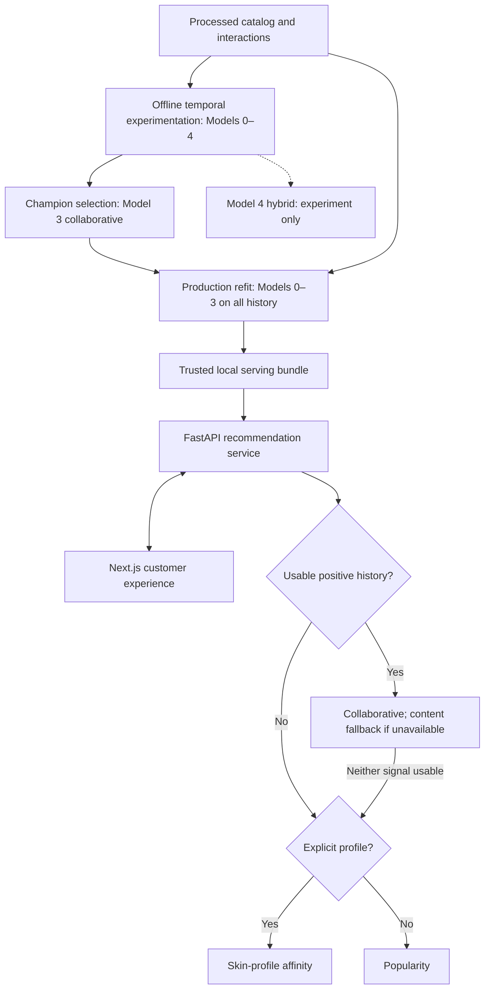

# GlowGuide

## Live Demo

GlowGuide is deployed end-to-end and can be tested directly in the browser. The customer-facing Next.js application is available at **[https://glowglide.vercel.app](https://glowglide.vercel.app)**, while the FastAPI recommendation backend is deployed at **[https://glowguide-api-v1.onrender.com](https://glowguide-api-v1.onrender.com)**. The backend exposes health, recommendation, and product-detail endpoints, with interactive API documentation available at **[https://glowguide-api-v1.onrender.com/docs](https://glowguide-api-v1.onrender.com/docs)**. Since the backend runs on Render’s free tier, the first request after a period of inactivity may take a little longer while the service wakes up.

**Explainable, context-aware personalized skincare recommendation system.**

Built for an Orbo.ai technical recruitment assignment, GlowGuide helps people discover skincare from their product history or an optional skin profile. It combines a consumer-facing experience with reproducible recommendation experiments and structured explanations. Recommendations describe historical preferences, not medical suitability.

## Demo / Product Experience

Run the application locally; no hosted deployment is provided. Start with a skin type and tone, or enter an authorized known demo user ID to use product history. Choose a budget, category and stock preference, then explore the ranked products. **Why this?** explains the selected strategy; **View details** retrieves product metadata. New users can try the experience without an ID. Restrictive filters produce a helpful empty state rather than unrelated filler.

See the [5–7 minute demo guide](docs/DEMO_GUIDE.md).

See [deployment readiness and local container verification](docs/DEPLOYMENT.md).

## Why GlowGuide?

Skincare discovery must accommodate sparse histories, new users, new products and different preference signals. GlowGuide compares these signals experimentally, retains the strongest ranker, and uses explicit fallback routes when personalization is unavailable. Explanations make the source of each recommendation inspectable. New-product recommendation remains a documented limitation.

## System Architecture



The service excludes historical seen items, applies business filters after ranking, and then takes Top-K. Filters never change scores or trigger a different model. [Architecture and lifecycle details](docs/ARCHITECTURE.md).

## Recommendation Models

| Model | Signal / role |
|---|---|
| 0 — Popularity | Distinct positive historical users per product; community fallback. |
| 1 — TF-IDF Content | Metadata cosine similarity to a positive-history profile; content fallback. |
| 2 — Skin Profile | Smoothed affinity from overall, type, tone and pair statistics; explicit-profile cold start. |
| **3 — Collaborative** | **Positive-user item cosine with significance shrinkage; production champion.** |
| 4 — Hybrid | Four normalized component scores, weights chosen on inner temporal validation; experiment only. |

Frozen outer benchmark, K=10. Values are fractions, not percentages; all six metrics use the same candidate catalog and servable cohort.

| Model | Precision@10 | Recall@10 | HitRate@10 | NDCG@10 | MAP@10 | Coverage@10 |
|---|---:|---:|---:|---:|---:|---:|
| 0 Popularity | 0.004319535904672345 | 0.019400548620429246 | 0.036688617121354655 | 0.012488504144695494 | 0.008448305955310126 | 0.01452513966480447 |
| 1 TF-IDF | 0.005566008153026048 | 0.02861881426481819 | 0.04813421135152085 | 0.015016724422000007 | 0.008496531214572863 | 0.9329608938547486 |
| 2 Skin Profile | 0.0036218250235183725 | 0.013767164409571316 | 0.03425838820947005 | 0.008641444499491528 | 0.004741340172614817 | 0.02346368715083799 |
| **3 Collaborative** | **0.012206020696142801** | **0.057273285260795496** | **0.09203512072750078** | **0.035985149669067955** | **0.024222856698542742** | **0.66815642458100555** |
| 4 Hybrid | 0.011375039197240354 | 0.050030374247063768 | 0.086625901536531824 | 0.030853807080895908 | 0.01955672419427102 | 0.63854748603351952 |

Model 3 wins all five relevance metrics. Model 1 reaches more of the catalog, but its relevance is lower. The more complex hybrid underperforms Model 3 on the outer test, so it was not promoted. [Full evaluation and interpretation](docs/MODEL_EVALUATION.md).

## Experimental Methodology

One global 80% timestamp-quantile cutoff, **2022-02-02**, separates 871,530 training interactions from 217,356 test interactions. Training includes timestamps at the cutoff; testing includes later timestamps. The training catalog contains 1,790 products. A chronological split better represents recommending from past history to future interactions than random splitting, which can mix future behavior into training.

Of 18,274 **history-eligible** users (at least two positive training interactions and one positive future interaction), 12,756 are **servable**: they have at least one positive future product in the training catalog. The remaining 5,518 are **cold-start-only**, or 30.195907% of eligible users. This label describes unreachable future products, not necessarily users without history.

Among 69,028 positive future interactions from eligible users, 38,096 (55.189199%) are outside the training catalog. Primary ranking metrics use reachable relevance for servable users; cold-start diagnostics separately expose what that benchmark cannot serve. All training-seen products, including negative interactions, are excluded. No stock or budget filter is applied to the offline benchmark.

## Hybrid Integrity

Model 4 splits outer training again at **2021-03-24**: 697,494 inner-training interactions, 174,036 inner-validation interactions, 1,458 inner candidates and 9,314 inner servable users. A 35-point coarse simplex and 491-point local refinement select weights by NDCG, then MAP, then Recall and deterministic weight order.

Frozen weights: **popularity 0.15, content 0.15, profile 0.10, collaborative 0.60**.

Fusion weights were selected using a nested global temporal validation split inside the outer training period. **The outer test set was not used for fusion-weight selection. The outer test was evaluated only after fusion weights were frozen.** Earlier models had already been benchmarked on that test; this is not a claim that the project's outer test had never been observed. The hybrid's weaker outer result left collaborative as champion.

## Explainability

- **Collaborative:** contributing positive-history products, similarities and contributions to the score.
- **Content:** shared TF-IDF terms from actual product metadata and the user's profile.
- **Skin profile:** smoothed historical affinity components and their support counts.
- **Popularity:** historical positive-user count.

These are inspectable preference signals, not causal explanations, clinical evidence or calibrated probabilities. No LLM is used.

## Production Serving

After offline model selection, Models 0–3 are refitted on **all 1,088,886 processed historical interactions** from 503,216 users. This intentionally includes the earlier evaluation periods for serving; it does not change the saved benchmark results. The serving catalog has 2,351 historically interacted products. The full skincare metadata catalog has 2,420 products; 69 without history are queryable as metadata but are not ranked.

The rebuilt local compressed bundle is approximately **36.19 MiB** (the earlier bundle was ~36.18 MiB). Earlier local service measurements were approximately **6.015 ms mean / 12.241 ms P95**, excluding HTTP transport and bundle loading. These are small-sample service measurements, not a load-test guarantee. Models load once per application lifespan; requests do not refit them. Model 4 is absent from the serving bundle.

## API

| Endpoint | Purpose |
|---|---|
| `GET /health` | Loaded bundle version, candidate count and historical user count. |
| `POST /recommendations` | Routed recommendations, raw scores, filters and explanations. |
| `GET /products/{product_id}` | Product metadata, including available cold-catalog records. |

See [API contracts and errors](docs/API.md). Local interactive documentation is at `http://localhost:8000/docs` after startup.

## Frontend

Next.js 16.3.5 App Router, React 19.3.0, TypeScript and Tailwind power a responsive consumer interface. It supports optional history, profile-only cold-start demos, budget/category/stock filters, loading skeletons, accessible explanation/detail dialogs and empty states. It uses only the HTTP API. Product placeholders are used because the API does not supply image URLs; no real user IDs are bundled into the client.

## Running Locally

Verified on Windows with Python 3.11.8, Node.js 22.19.0 and npm 10.9.3. The commands use repository-relative paths; Linux has not been tested in this handover.

From the repository root:

```sh
python -m venv .venv
```

Activate in PowerShell:

```powershell
.venv\Scripts\Activate.ps1
```

Or activate in bash:

```bash
source .venv/bin/activate
```

Place `product_info.csv` and the dataset's `reviews_*.csv` files in `data/raw/` **before preprocessing**. [Required data and the optional download helper](docs/HANDOVER.md#required-data) describe the exact layout. Raw data, processed data and artifacts are ignored by Git and must be obtained/generated locally.

```sh
python -m pip install -r requirements.txt
python scripts/build_processed_data.py
python scripts/build_serving_bundle.py
python -m uvicorn glowguide.api.main:app --app-dir src --reload
```

In another terminal:

```sh
cd frontend
npm ci
npm run dev
```

Open `http://localhost:3000`. The browser API URL uses `NEXT_PUBLIC_GLOWGUIDE_API_URL`, with `http://localhost:8000` as the default. For an override, copy [frontend/.env.example](frontend/.env.example) to `frontend/.env.local`, edit it and restart Next.js. API bundle/CORS configuration is in [the handover](docs/HANDOVER.md).

## Tests

Current handover verification:

| Command | Result |
|---|---|
| `python -m pytest -q` (root) | **134 passed, 2 warnings, 84 subtests passed in 8.97s** |
| `npm run lint` (`frontend/`) | Exit 0; no lint errors or warnings. |
| `npm test` (`frontend/`) | **2 files, 21 tests passed**, 5.01s. |
| `npm run build` (`frontend/`) | Exit 0; TypeScript and optimized build passed; `/` and `/_not-found` prerendered. |
| `python scripts/build_serving_bundle.py` | Full-history bundle and manifest rebuilt successfully. |

Backend warnings concern upstream Starlette/httpx and AnyIO deprecations. Frontend tests mock API responses. This documentation pass did not rerun expensive hybrid tuning or the frozen model benchmarks; their recorded metrics were checked against local artifacts. See [verification details](docs/HANDOVER.md#verification-record).

## Repository Structure

```text
docs/                       Architecture, evaluation, API, handover and demo
data/raw/                   Local source CSVs (ignored)
data/processed/             Local cleaned CSVs (ignored)
artifacts/                  Metrics, tuning results and serving bundle (ignored)
scripts/                    Data preparation, EDA, experiments and bundle build
src/glowguide/
  recommenders/             Models 0–4
  evaluation.py, metrics.py, split.py
  serving.py, serving_artifacts.py
  api/                      FastAPI application and schemas
tests/                      Synthetic Python tests
frontend/                   Next.js application and mocked API tests
```

## Limitations

This is a historical Sephora review dataset with rating-based relevance and static metadata, including historical inventory. Collaborative filtering cannot rank products without interaction history. Profile fields are coarse; content similarity does not guarantee preference. There is no image-based skin diagnosis or medical suitability engine. Offline relevance is not user satisfaction, and no online A/B test has been run. Authentication, rate limiting and production monitoring are not implemented. [Detailed limitations and privacy considerations](docs/LIMITATIONS.md).

## Future Work

Priorities are live catalog/inventory synchronization, richer feedback and cold-start content representations, diversity/MMR experiments, online evaluation, model monitoring and secure user accounts. These are future directions, not implemented capabilities.
