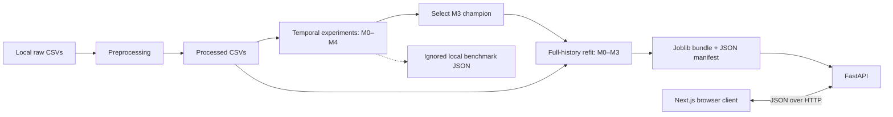
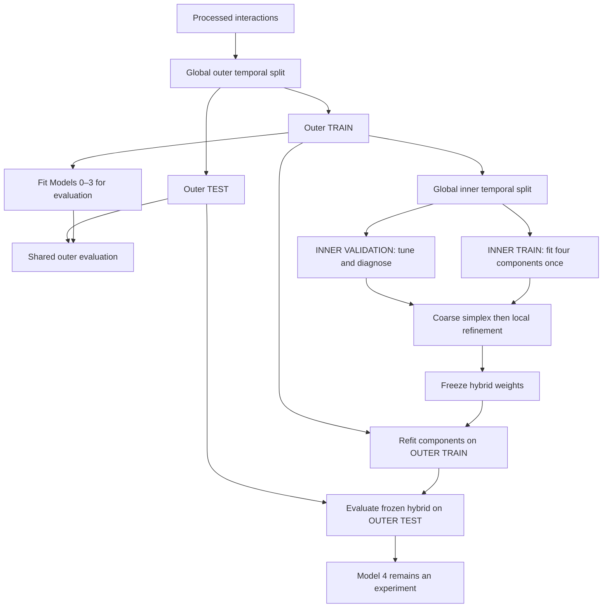
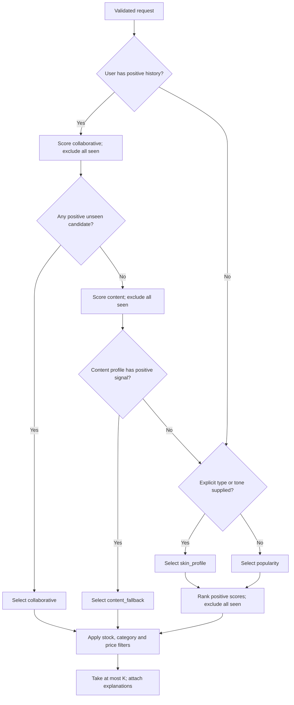
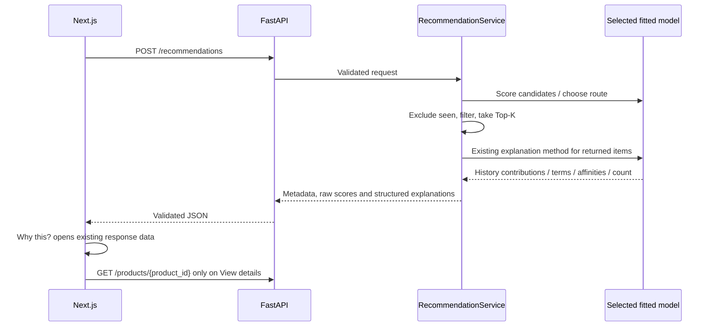

# Architecture

[Project overview](../README.md) · [Evaluation](MODEL_EVALUATION.md) · [API](API.md) · [Handover](HANDOVER.md)

## High-level architecture

GlowGuide separates experiments that measure future relevance from artifacts that serve current application requests. The browser never loads Python models or accesses CSVs directly.

## Offline experimentation

`split.py` defines one timestamp-quantile cutoff for the whole dataset. `evaluation.py` constructs history eligibility, reachable relevance, seen sets and cold-start diagnostics. `metrics.py` defines the shared metrics. Individual scripts fit each model on training data and call the shared evaluator; inventory and commercial filters are absent.

Model 4 normalizes each user's component vector by its maximum, renormalizes weights over available signals and fuses scores. Cached inner scores avoid refitting per weight tuple. No outer-test data is passed to the tuning entry point. An inner ablation study is diagnostic and does not change selected weights.

The outer comparison selected Model 3. It did not justify replacing the champion with a more complex but weaker hybrid.

## Production-serving architecture

`build_serving_bundle.py` fits Models 0–3 on all processed history without a split. `ServingBundle` contains those four fitted models, metadata, all-history seen sets, positive-history users and build metadata. Candidate ordering must agree across models. Full catalog metadata is indexed separately from the historical candidate set.

The FastAPI lifespan loads and validates one trusted bundle per application instance. There is no per-request training, online update or database. Reloading/restarting the process loads the artifact again. The bundle loader validates version, dependency versions, model classes and catalog alignment; joblib deserialization requires a trusted local source.

## Request routing decision tree

“History available” means membership in the bundle's positive-history user set, not merely a recognized ID. A recognized negative-only user still has all seen products excluded. A usable content profile can select `content_fallback` even if seen exclusion leaves its pool empty. Request profile values do not override usable history-based routing.

All historical candidate scores are computed; the implementation does **not** truncate to a heuristic 100-item pool. Only positive scores survive, with descending score and ascending product ID for ties. `candidate_pool_size` is the positive unseen pool before business filters. A short or empty filtered result does not trigger another strategy.

## Component responsibilities

| Component | Responsibility |
|---|---|
| `data.py`, `preprocessing.py` | Required CSV loading, ID/type cleanup, skincare filtering, latest user-product deduplication and labels. |
| `features.py` | Metadata-only product text; excludes ratings, review counts and popularity features. |
| `profile.py` | Deterministic historical user-profile inference. |
| `recommenders/` | Fitting, aligned raw candidate scores, ranking and strategy-specific explanations. |
| `split.py`, `evaluation.py`, `metrics.py` | Frozen temporal and ranking benchmark semantics. |
| `tuning.py` | Inner-only hybrid weight search and ablations. |
| `serving_artifacts.py` | Full-history fitting, sanitized metadata, serialization and compatibility checks. |
| `serving.py` | Routing, seen exclusion, business filters, Top-K and explanation adaptation. |
| `api/schemas.py`, `api/main.py` | Validation, finite JSON contracts, lifespan, CORS and HTTP endpoints. |
| `frontend/lib/api.ts` | Typed API access, status handling and friendly network errors. |
| `frontend/components/` | Form, cards, loading/empty states and accessible explanation/detail dialogs. |

## Data and artifact lifecycle

1. Obtain the historical raw catalog/review CSVs locally.
2. Preprocess into `products_skincare.csv` and `interactions.csv`. Invalid required review values are discarded; duplicate user-product pairs retain the latest review (last input row breaks timestamp ties).
3. Run temporal experiments separately. Candidate universes, profiles and learned statistics derive from the corresponding training period. Product text comes from a static catalog snapshot, not timestamped metadata history.
4. Preserve benchmark and hybrid-tuning JSON as experimental records. They are locally ignored, so a handover must regenerate or securely transfer them if needed.
5. After architecture selection, build the serving bundle on full history. The manifest records scope, counts, time range, fixed model configuration, class names, serialization dependencies and UTC creation time.
6. Start the API against the trusted artifact. Rebuild and restart deliberately after changes to history or serialization environment. There is no automatic retraining scheduler or artifact registry.

The serving manifest is not an evaluation artifact. Refitting on all history must not be used to claim held-out benchmark performance for the serving instance.

## Explainability flow

Collaborative explanations resolve up to three history IDs to names and preserve score contributions plus the remainder. Content shows up to five matching terms. Explicit profile explanations reuse Model 2's learned tables and smoothing. No explanation is generated by an LLM or represents a medical/causal claim.
